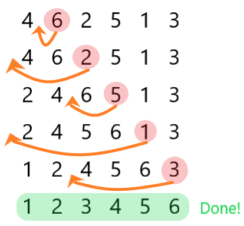

## Insertion Sort

삽입 정렬은 배열의 요소와 선택된 요소의 좌측 요소들과 비교하여 옳바른 자리에 삽입을 통해 오름차순 또는 내림차순으로 정렬하는 방법입니다.  

  

### Pseudo Code

```
-배열의 두번째 요소부터 마지막 요소까지 반복
  -선택된 요소부터 좌측으로 첫번재 요소까지 반복
    -만약 선택된 요소가 좌측에 있는 요소보다 작으면 자리 교체
```

### Implementation Code(JS)

``` javascript
let arr = [4,6,2,5,1,3];
for(let i = 1; i < arr.length; i++){
  key = arr[i];
  let j = i-1;
  while(j >= 0 && arr[j] > key){
    arr[j+1] = arr[j];
    j -= 1;
  }
  arr[j+1] = key;
}
console.log(arr);
//[1, 2, 3, 4, 5, 6] 출력
```

### 성능 비교(O notation)
- Best case: $O(n)$
- Worst case: $O(n^2)$

###### 참고 사이트
<https://rddcat.github.io/insertion-sort/>  
<https://velog.io/@jangws/9.-%EC%82%BD%EC%9E%85-%EC%A0%95%EB%A0%ACInsertion-sort>